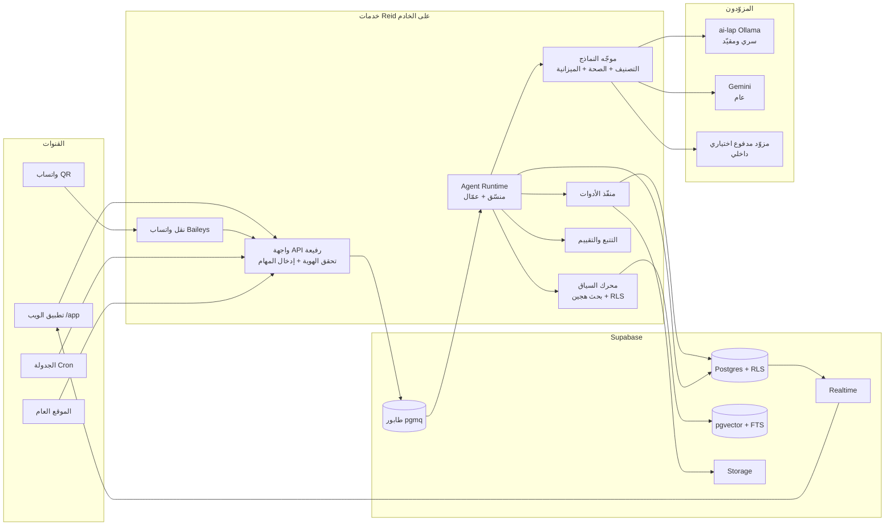
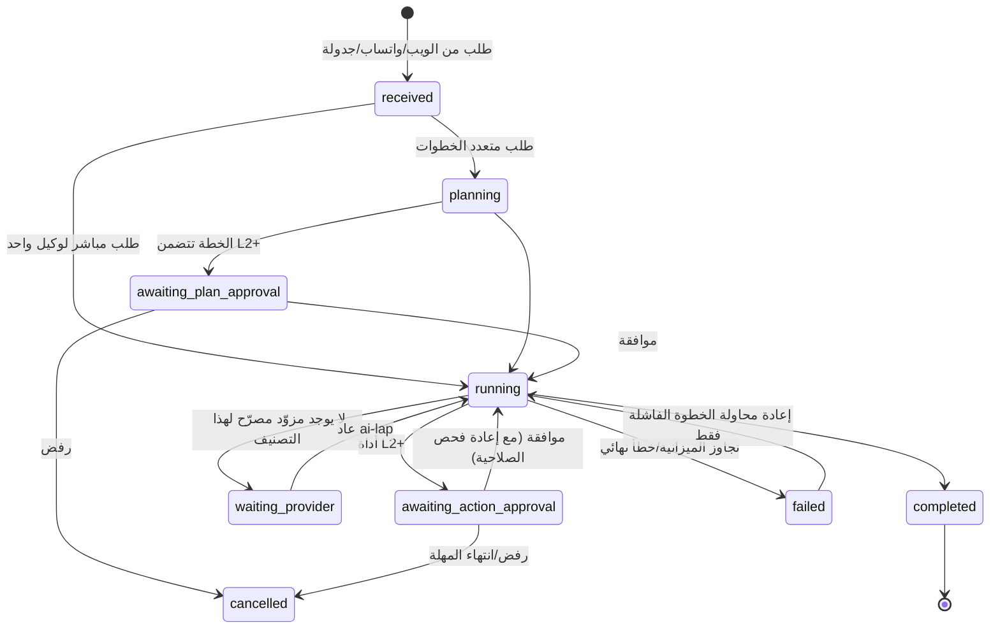

# خطة إعادة بناء ريّد — Reid 2.0

التاريخ: 28 سبتمبر 2026
الحالة: **مسودة للاعتماد**. لم يُنفّذ منها شيء بعد.
النطاق: إعادة بناء الموقع كاملًا: الواجهة، منظومة الوكلاء، نظام التصميم، هيكل الكود، الاختبارات والتشغيل.
الثابت: **الاسم (ريّد / Reid) والشعار** فقط. بيانات الإنتاج والحسابات ومعرّفاتها وسجل التدقيق تبقى وتُنقل كما هي، ولا يُحذف منها شيء.
العلاقة بالخطط السابقة: بعد الاعتماد تحل هذه الخطة محل `docs/SITE_RESTRUCTURE_PLAN_20260928.md`. تلك الخطة رتّبت التنقل فوق الأساس الحالي، أما هذه فتستبدل الأساس نفسه.

---

## 0. الملخص التنفيذي

1. **المشكلة الجوهرية ليست الشكل.** الوكلاء حاليًا نماذج محادثة تُرسل لها لقطة ثابتة من الجداول. لا تستدعي الأدوات بنفسها، وتنسيق التسليم بينها يجري **داخل متصفح المستخدم**، فإذا أُغلق التبويب توقف العمل. معظمها معطّل أيضًا بسبب قيود المزوّد.
2. **الحل:** محرك وكلاء جديد يعمل على الخادم. المهام فيه دائمة ولها خطة وخطوات، والوكيل يستدعي الأدوات بنفسه عبر function calling. السياق يُسترجع حسب الطلب وتحت صلاحيات الطالب نفسه (RLS)، والذاكرة منظّمة، وكل خطوة تُقيَّم وتُتتبّع.
3. **الواجهة:** تطبيق جديد مقسّم حسب المجالات، مبني على نظام تصميم مستخرج من ألوان الشعار، مع مكونات موحدة تدعم RTL/LTR والوضع الداكن والهاتف ومعايير الوصول. في كل صفحة مساعد يعرف سياقها.
4. **هيكل معلومات أبسط:** عشرة أقسام واضحة بدل 14 صفحة متداخلة. صفحة رئيسية واحدة تتكيّف مع الدور، ومركز موافقات موحد، وقسم جديد للمعرفة يغذّي الوكلاء.
5. **الانتقال بلا توقف:** يُبنى التطبيق الجديد بجوار الحالي (نمط Strangler) تحت `/app` ويُحوَّل إليه قسمًا قسمًا بمفاتيح تفعيل. الترحيلات إضافية فقط، ولكل خطوة صورة رجوع.
6. **المدة التقديرية:** نحو 12 أسبوعًا في ستة مراحل، بافتراض فريق صغير يعمل مع وكلاء برمجة. تسير الواجهة ومحرك الوكلاء في مسارين متوازيين.
7. **قبل أي بناء** يلزم إصلاح أمني واحد: صف مزوّد `gemini` في الإنتاج يسمح بتصنيف `restricted`، وهذا يخالف القرار الموثق بحصره في `public` لأنه على الطبقة المجانية. الصف **معطّل حاليًا** (`enabled=false`)، فالخطر كامن وليس نشطًا، لكنه يصبح فعليًا بمجرد تفعيله (القسم 12).

---

## خط الأساس المقاس (28 سبتمبر 2026)

| المؤشر | القيمة |
| --- | --- |
| اختبارات الواجهة | 194/194 ناجحة في 13 ملفًا |
| حزمة JavaScript الرئيسية | 255.6KB (81.4KB gzip)، والإجمالي مع حزم المسارات نحو 468KB |
| CSS الرئيسي | 100KB (17.8KB gzip) |
| تشغيلات الوكلاء خلال 30 يومًا | 62 ناجحة، 5 فاشلة (4 منها `local_only_policy`)، 1 ملغاة، وكلها على ollama |
| زمن التشغيل الناجح | p50 = 10.7 ثانية، p95 = 29.3 ثانية، ومتوسط درجة الجودة 97.1 |
| حالة ai-lap | متصل (runner v1.2.2) |
| مزوّد gemini | معطّل، لكن `max_classification='restricted'` |

---

## 1. ما يبقى، وما يُعاد بناؤه، وما يُحذف

| يبقى كما هو | يُعاد بناؤه من الصفر | يُحذف بعد التحويل |
| --- | --- | --- |
| الاسم ريّد / Reid والشعار `reid-logo.svg` | تطبيق الواجهة كاملًا (الغلاف، التنقل، كل الصفحات) | `src/main.tsx` الأحادي و15 ملف CSS متراكمة |
| مشروع Supabase الحالي وبياناته (22 ألف سجل، 116 حسابًا بمعرّفاتها) | محرك الوكلاء: التنسيق، الأدوات، السياق، الذاكرة، التقييم | التنسيق داخل المتصفح في `os-workspace.tsx` |
| سياسات RLS وسجل التدقيق (تُراجع وتُوسّع ولا تُستبدل) | نظام التصميم والمكونات | قوائم الوكلاء المكررة في أربعة أماكن على الأقل |
| مبادئ الحوكمة: التصنيفات الأربعة ومستويات الموافقة L0–L4 | الموقع العام (مع الإبقاء على الهوية) | Cloudflare Worker المحتفظ به للرجوع، بعد ثبات الإنتاج |
| قرار «لا أموال داخل النظام» | منطق المساعد المشترك بين الويب وواتساب | `content/legacy/` بعد نقل ما يلزم منه |
| جلسة واتساب المشفرة والنقل عبر QR | هيكل المستودع ومعايير الكود و`AGENTS.md` | أنماط `(data \|\| [])` التي تخفي الأخطاء |
| الاستضافة الحالية: حاويات على خادم Reid عبر Cloudflare Tunnel | الاختبارات والمراقبة | |

---

## 2. التشخيص: ما وجدناه في الكود

### 2.1 الوكلاء

| # | المشكلة | الدليل | الأثر |
| --- | --- | --- | --- |
| A1 | التنسيق بين الوكلاء يجري في المتصفح | حلقة `while(queue.length)` داخل `send` في `src/os-workspace.tsx:92` | إغلاق التبويب أو انقطاع الشبكة يوقف السلسلة ويترك رسائل معلّقة، ولا يمكن تشغيل مهمة من واتساب أو من جدولة بنفس المسار |
| A2 | الوكيل لا يستدعي الأدوات بنفسه | `executeRun` في `llm-gateway` ينفّذ طلبًا نصيًا واحدًا، والأدوات لا تعمل إلا عندما يضغط المستخدم زرًا (`action:'tool'`) | «الوكيل» عمليًا روبوت محادثة، لا منفّذ مهام |
| A3 | السياق لقطة ثابتة لا علاقة لها بالسؤال | `buildAgentContext` يجلب آخر 30 صفًا من جداول محددة لكل وكيل | إجابات تفوّت البيانات المطلوبة، وسياق يصل إلى 60 ألف حرف بلا فائدة |
| A4 | قراءات السياق تتجاوز RLS | `rows(admin, …)` تستخدم مفتاح service role | الوكيل يرى ما لا يحق للطالب رؤيته، والحماية الوحيدة قوائم ثابتة في الكود |
| A5 | الذاكرة بلا استرجاع دلالي وتتراكم عشوائيًا | `scopedMemories` تجلب 120 سجلًا حديثًا وترشحها إلى 24، و`executeRun` يحفظ كل إجابة ناجحة كذاكرة | pgvector موجود لكنه لا يُستخدم للاسترجاع، والذاكرة تمتلئ بإجابات مكررة |
| A6 | تعريف الوكلاء مكرر | `agentTopology` في `agents.ts`، و`agentNames`/`aliases` في `agent-room.ts`، وقوائم في `llm-gateway` و`whatsapp-webhook` | إضافة وكيل أو تعديله تتطلب تعديل خمسة ملفات، وأي نسيان يسبب سلوكًا متناقضًا |
| A7 | التسليم عبر نص حر `[HANDOFF:@id]` | `resolveAgentHandoffs` | صيغة هشة يمكن أن يولدها النموذج خطأً أو ينساها، بلا مُخرَج متوقع ولا ميزانية |
| A8 | كل الوكلاء يعتمدون على جهاز واحد | كل الوكلاء مربوطون بـ`ollama` على ai-lap، وGemini معطّل. عند قياس 28 سبتمبر كان ai-lap متصلًا: 62 تشغيلًا ناجحًا و5 فاشلة خلال 30 يومًا، والزمن p50 = 10.7 ثانية وp95 = 29.3 ثانية | أي انقطاع لـai-lap يوقف الفريق كله، ولا يوجد بديل مصرّح للبيانات الداخلية |
| A9 | «عقلان» منفصلان | مساعد واتساب في `server/*.mjs` (intent, memory, recall, quality, clock, policy) مقابل `llm-gateway` و`_shared/agent-quality.ts` | منطق الجودة والذاكرة والوقت مكرر ويتباعد، وتحسين أحدهما لا يصل للآخر |
| A10 | تنفيذ متزامن بلا بث | استدعاء النموذج داخل Edge Function ينتظر الإجابة كاملة | انتظار طويل بلا مؤشر، واحتمال تجاوز حد زمن الدالة |
| A11 | لا يوجد تقييم منهجي | فحص جودة إرشادي فقط، ولا توجد مجموعات اختبار لكل وكيل | تعديل الـprompt قد يكسر السلوك دون أن يلاحظ أحد |
| A12 | لا تتبع ولا ميزانيات | تُحفظ معاينة 280 حرفًا فقط، وحدود المعدل تُحسب بعدّ الصفوف | يصعب تفسير فشل مهمة أو معرفة الكلفة لكل وكيل |

### 2.2 الواجهة والكود

- `src/main.tsx` بحجم 67KB يجمع تسجيل الدخول والانضمام والملف الشخصي ولوحة الإدارة (نحو 630 سطرًا) والمحادثة العامة والقائمة الجانبية وجذر التطبيق.
- في ملفات `.tsx` يوجد **87 سطرًا تتجاوز 400 حرف**، وملف `os-workspace.tsx` (26KB) مكتوب في 102 سطر فقط. هذا الكود لا يمكن مراجعته أو اختباره جزئيًا.
- ثلاثة ملفات يتجاوز كل منها ألف سطر: `employee.tsx` و`projects.tsx` و`research.tsx`.
- لا توجد طبقة تخزين مؤقت للبيانات: `loadAgentControl` يطلق 11 استعلامًا عند كل تحديث، و`agent-command.tsx` يستعلم كل 5 ثوانٍ فوق اشتراك Realtime.
- التوجيه مكتوب يدويًا (`useRoute`) بلا معاملات بحث مكتوبة الأنواع ولا تحميل مسبق للبيانات.
- قاعدة المشروع تمنع `(result.data || [])`، ومع ذلك يستخدمها `agents.ts` نفسه.

### 2.3 التصميم

- 15 ملف CSS بحجم 117KB، منها `reid-os.css` وحده بـ54KB. هناك ثلاثة أجيال من الأنماط (`style.css` ثم `workspace-shell.css` ثم `reid-os.css`) بكثافات وعناوين وأزرار مختلفة.
- ملف `tokens.css` واختباره نقطة قوة يجب البناء عليها. لكنه يغطي الألوان والحواف فقط، ولا يشمل الطباعة والمسافات والحركة والكثافة.
- لا توجد مكتبة مكونات، فكل صفحة تعيد بناء الأزرار والجداول والحالات الفارغة بطريقتها.

### 2.4 التشغيل والأمان

- `AGENTS.md` حجمه **200KB**. هذا يستهلك سياق أي وكيل برمجة قبل أن يبدأ العمل، ويخلط القواعد بسجل تاريخي طويل.
- `llm-gateway` يسمح بـ`Access-Control-Allow-Origin: *`.
- مفاتيح Tavily وGemini وسرّ Google OAuth ظهرت في محادثات، وتدويرها ما زال مفتوحًا.
- النسخ الاحتياطي الأسبوعي متوقف بسبب سرّ `SUPABASE_DB_URL` غير صالح، ولم يُجرَ اختبار استعادة ناجح.
- بيئة الاختبار (Cloudflare Pages) لا تطابق بنية الإنتاج (حاويات على خادم).

---

## 3. المبادئ الحاكمة

1. **الخادم هو صاحب القرار.** لا يُنفَّذ منطق الوكلاء في المتصفح، ولا تُمنح الواجهة أي صلاحية. قاعدة البيانات وRLS هي الحد الأمني الفعلي.
2. **مصدر حقيقة واحد لكل شيء.** تعريف الوكلاء والأدوات والمسارات والصلاحيات والنصوص موجود في مكان واحد، وتُشتق منه بقية الأجزاء.
3. **الوكيل يعمل بهوية من طلبه.** كل قراءة ينفذها وكيل تمر عبر RLS بصلاحيات الطالب نفسه.
4. **التصنيف قيد صارم.** لا تعبر بيانات إلى مزوّد أو نموذج تضمين يتجاوز تصنيفه، ويُفرض ذلك في قاعدة البيانات وفي الموجّه معًا.
5. **كل فعل مؤثر له معاينة وموافقة وسجل** بحسب مستواه (L0–L4)، مع مفتاح منع التكرار (idempotency).
6. **ما لا يُقاس لا يُحسَّن.** لكل وكيل مجموعة تقييم، ولكل مهمة أثر كامل، ولكل مزوّد ميزانية.
7. **انتقال تدريجي قابل للرجوع.** لا يوجد إطلاق شامل دفعة واحدة، ولا ترحيلات تحذف بيانات.
8. **كود مقروء أولًا.** التنسيق يفرضه Prettier، وحجم الملفات محدود، وكل ميزة في مجلد خاص بها. الكود يقرؤه البشر ووكلاء البرمجة على حد سواء.

---

## 4. البنية المستهدفة

### 4.1 الصورة العامة



### 4.2 هيكل المستودع

```text
reid/
├─ apps/
│  ├─ web/                 # تطبيق React: الموقع العام + /app
│  │  └─ src/
│  │     ├─ app/           # الغلاف، التوجيه، المزوّدات، الأخطاء
│  │     ├─ features/      # مجلد لكل مجال: home, agents, approvals, tasks,
│  │     │                 # projects, clients, people, inbox, knowledge,
│  │     │                 # research, workshops, admin, me, public
│  │     │   └─ <feature>/{api, components, routes, hooks, schemas, *.test.tsx}
│  │     └─ lib/
│  ├─ services/            # نقل واتساب + API الحالي (Express) بعد تنظيفه
│  └─ agent-runtime/       # المنسّق والعمّال ومنفذ الأدوات والموجّه
├─ packages/
│  ├─ ui/                  # نظام التصميم: tokens + مكونات + Storybook
│  ├─ agents-core/         # أنواع السجل، السياسات، الجودة، الوقت، الـprompts (مشترك بين الويب وواتساب)
│  ├─ db/                  # أنواع Supabase المولدة + الاستعلامات + Zod
│  └─ i18n/                # القواميس ورسائل ICU وتنسيق التاريخ والأرقام
├─ supabase/               # migrations, functions (رفيعة), tests
├─ evals/                  # مجموعات تقييم الوكلاء
├─ infra/                  # compose, nginx, tunnel, ai-lap
└─ docs/                   # معمارية، قرارات ADR، دليل التشغيل، سجل التغييرات
```

### 4.3 الاختيارات التقنية

| الطبقة | الاختيار | سبب الاختيار | يستبدل |
| --- | --- | --- | --- |
| المستودع | npm workspaces | أقل تغيير عن الأدوات الحالية، ويسمح بمشاركة الحزم | مستودع مسطح |
| الواجهة | React 19 + Vite 7 + TypeScript strict | معروفة ومجرّبة هنا، ولا داعي لتغيير الإطار | — |
| التوجيه | TanStack Router | مسارات ومعاملات بحث مكتوبة الأنواع، تحميل مسبق، تقسيم تلقائي للحزم | `useRoute` اليدوي |
| البيانات | TanStack Query + أنواع Supabase المولدة + Zod | تخزين مؤقت، دمج الطلبات المتكررة، إبطال عبر Realtime بدل الاستعلام الدوري | الاستعلام كل 5 ثوانٍ |
| المكونات | Radix Primitives + Tailwind CSS v4 + CVA | وصول مضمون، `DirectionProvider` للـRTL، والـtokens متغيرات CSS | CSS يدوي متراكم |
| النماذج | React Hook Form + Zod | تحقق موحد بين الواجهة والخادم | حقول يدوية |
| الجداول والقوائم | TanStack Table + TanStack Virtual | جداول تتحول إلى بطاقات على الهاتف، ومحادثات طويلة بلا بطء | — |
| لوحة الأوامر | cmdk | بحث وتنقل وأوامر وسؤال وكيل من مكان واحد | المشغّل الحالي |
| الرسوم البيانية | Recharts مغلّفة بمكونات النظام | مكتبة واحدة بألوان النظام | — |
| الترجمة | قواميس مكتوبة الأنواع + ICU (FormatJS) | صيغ الجمع العربية الست والتواريخ والأرقام بـ`Intl` | قواميس متناثرة |
| التطبيق على الهاتف | PWA + Web Push | تثبيت على الهاتف وإشعار فوري بالموافقات | — |
| محرك الوكلاء | خدمة Node 22 + TypeScript على خادم Reid | عمّال طويلو الأمد بلا حد زمني لدوال Edge، ويشارك الكود مع خدمة واتساب | `llm-gateway` المتزامن |
| الطابور | Supabase Queues (pgmq) | داخل Postgres: معاملات، إعادة محاولة، بلا خدمة إضافية | حالات في `agent_runs` فقط |
| التتبع | Langfuse مستضاف ذاتيًا أو OpenTelemetry | أثر كل مهمة يبقى داخل الشركة | معاينة 280 حرفًا |
| الأخطاء | GlitchTip (متوافق مع Sentry) مستضاف ذاتيًا | أخطاء الواجهة والخادم في مكان واحد | لا يوجد |
| الموقع العام | عرض مسبق وقت البناء (SSG) | سرعة وSEO، واستجابة 404 حقيقية | SPA يرد 200 لكل مسار |
| الاختبارات | Vitest + Testing Library + Playwright + axe-core + Storybook | هرم اختبارات كامل | اختبارات متفرقة |

---

## 5. منظومة الوكلاء 2.0 — قلب الخطة

### 5.1 الفريق الجديد: وكلاء أقل وأعمق

عشرة وكلاء رفيعين يتداخل بعضهم مع بعض (التسويق والمحتوى والمنافسون، والمبيعات والدعم) يعني ردودًا مكررة وتسليمات أكثر من اللازم. التوصية ثمانية وكلاء، لكل منهم **مهارات** (أدوات وتعليمات) بدل تفتيت الاختصاص. المعرّفات القديمة تبقى أسماءً بديلة (aliases) حتى لا ينكسر السجل ولا المنشن.

| الوكيل الجديد | يدمج | الاختصاص | التصنيف الأقصى | المزوّد |
| --- | --- | --- | --- | --- |
| **المنسّق** `chief` | ceo | يفهم الهدف، يضع الخطة، يوزّع العمل، يكتب الموجز اليومي | internal | ai-lap أو مزوّد مدفوع |
| **التشغيل** `operations` | operations | المشاريع والمهام والمواعيد والورش والاختناقات | internal | ai-lap أو مزوّد مدفوع |
| **النمو** `growth` | marketing, content, competitor | الحملات والمحتوى ورصد السوق والنشر (L2) | public | Gemini |
| **العملاء** `clients` | sales, support | المسار البيعي والمتابعات والرسائل والدعم | confidential | ai-lap فقط |
| **الفريق** `people` | hr | الموظفون والتوظيف والتهيئة (يوصي فقط ولا يقرر) | restricted | ai-lap فقط |
| **الرؤى** `insights` | analytics | المؤشرات والتقارير PDF/Word/Excel والتنبيهات | internal | ai-lap أو مزوّد مدفوع |
| **المعرفة** `knowledge` | knowledge | البحث في وثائق الشركة والأبحاث والويب مع الاستشهاد | حسب المصدر | حسب التصنيف |
| **الأنظمة** `systems` | جديد | حالة الموقع والخادم وواتساب وai-lap، وملخص الحوادث (قراءة فقط) | internal | ai-lap أو مزوّد مدفوع |

> إذا فضّل المالك إبقاء العشرة، يبقى المحرك كما هو ويتغير السجل فقط. القرار في القسم 17.

### 5.2 مكونات المحرك

| المكون | مسؤوليته |
| --- | --- |
| **سجل الوكلاء** `agent_definitions` + `agent_versions` | المصدر الوحيد للاسم والأسماء البديلة والشخصية والتعليمات والأدوات ونطاقات الذاكرة والتصنيف والميزانية والوكلاء المسموح التسليم إليهم. كل تعديل ينشئ نسخة جديدة تمر بالمراحل: مسودة، تقييم، تجربة محدودة، ثم تفعيل |
| **سجل الأدوات** `agent_tools` v2 | مخطط JSON لكل أداة، نوع العملية، مستوى الموافقة، التصنيف، المهلة، وهل هي آمنة للتكرار. يُعرض للنموذج كـfunction calling أصلي |
| **المنسّق** | يحوّل الطلب إلى مهمة، ويطلب خطة من `chief` عند الحاجة، ويوزّع الخطوات، ويشغّل المستقل منها بالتوازي |
| **العمّال** | يسحبون الخطوات من الطابور وينفذون حلقة: تفكير، ثم استدعاء أداة، ثم ملاحظة النتيجة، ثم رد، ضمن حد أقصى للخطوات |
| **منفّذ الأدوات** | ينفذ القراءة داخل معاملة Postgres تنتحل هوية الطالب (`SET LOCAL ROLE authenticated` + `request.jwt.claims`) حتى تطبق RLS، وينفذ الكتابة عبر دوال RPC محكومة فقط |
| **محرك السياق** | يسترجع حسب الطلب بدل اللقطة الثابتة (القسم 5.5) |
| **الذاكرة** | استخراج وتنقية واسترجاع وقابلية للمراجعة (القسم 5.6) |
| **موجّه النماذج** | يختار المزوّد حسب التصنيف والقدرة والصحة والميزانية، مع قاطع دائرة (القسم 5.7) |
| **الحراسة** | فصل البيانات غير الموثوقة، والتحقق من المخرجات، وحجب الأسرار، ومنع الادعاء بتنفيذ ما لم يُنفَّذ (القسم 5.8) |
| **التتبع والتقييم** | أثر كامل لكل مهمة، وسجل استهلاك، ومجموعات تقييم (القسمان 5.9 و5.10) |

### 5.3 دورة حياة المهمة



**حدود صارمة لكل مهمة** (تُعدَّل من الإعدادات):

- 12 خطوة كحد أقصى، وعمق تسليم لا يتجاوز 2، وأربعة وكلاء في المهمة الواحدة، و10 دقائق زمنًا إجماليًا.
- ميزانية tokens لكل مهمة ولكل مستخدم يوميًا ولكل مزوّد يوميًا.
- التسليم يتم عبر أداة `delegate(agent, brief, expected_output)` بدل النص الحر. لا يُسلَّم لوكيل نفّذ خطوته في نفس المهمة إلا بسبب جديد، وتُكتشف الحلقات وتُمنع.
- مفتاح إيقاف عام وآخر لكل وكيل.

### 5.4 الأدوات

كل أداة لها مخطط وتصنيف ومستوى موافقة، ومفتاح منع تكرار هو `step_id`. لا توجد أداة «SQL حر».

| المجال | الأدوات | المستوى |
| --- | --- | --- |
| مشترك | `search_company`، `get_record`، `ask_user` (سؤال توضيحي)، `delegate` | L0 |
| مشترك | `remember`، `create_document` (PDF/Word/Excel، موجود في `server/artifacts.mjs`)، `schedule_reminder` | L1 |
| الويب | `web_search`، `web_read` (Tavily، ولا يُرسل معها أي محتوى داخلي) | L0 |
| التشغيل | `tasks.list/create/update`، `projects.summary` | L0–L1 |
| التشغيل | إعادة إسناد مهمة لغير الطالب، `milestones.update`، `meetings.schedule` | L2 |
| العملاء | `crm.pipeline`، `crm.lead.create`، `crm.follow_up.create`، `message.draft` | L0–L1 |
| العملاء | `crm.stage.move`، `whatsapp.send` | L2 |
| النمو | `content.draft.create`، `competitor.scan` | L0–L1 |
| النمو | `content.publish` | L2 |
| الفريق | `people.list`، `applications.summarize`، `onboarding.create` | L0–L1 |
| الفريق | القرار في طلب توظيف: **ليس أداة للوكيل**. الوكيل يوصي والإنسان يقرر | L3 بشري |
| الرؤى | `metrics.query` (مؤشرات معرّفة مسبقًا عبر RPC)، `report.generate` | L0–L1 |
| المعرفة | `knowledge.search`، `knowledge.page.draft` | L0–L1 |
| الورش | `workshop.draft` / `workshop.publish` | L1 / L2 |
| الأنظمة | `ops.status`، `whatsapp.status`، `runner.status`، `errors.recent` | L0 |

الإقلاع وإعادة التشغيل والنشر تبقى **خارج** متناول الوكلاء، التزامًا بالقرار الموثق.

### 5.5 السياق والمعرفة

- **استرجاع هجين:** يجمع بحث المتجهات (pgvector) مع بحث النص الكامل في Postgres. يمر النص العربي أولًا بتطبيع (إزالة التشكيل، توحيد الألف والياء والتاء المربوطة)، ثم تُرتّب النتائج بدمج الترتيبين (RRF) مع وزن للحداثة.
- **ACL قبل الاسترجاع:** البحث يعمل داخل معاملة تنتحل هوية الطالب، فلا يعود من النتائج إلا ما يحق له رؤيته.
- **المصادر:** ملفات المشاريع، ووثائق الأبحاث، والإعلانات، والورش، وصفحات المعرفة الجديدة، وملاحظات العملاء (مصنّفة `confidential`).
- **التقطيع والتضمين في الخلفية:** كل إدراج أو تعديل يدخل الطابور. **نموذج التضمين يخضع للتصنيف أيضًا**: المحتوى السري يُضمَّن محليًا على ai-lap فقط، ولا يُرسل إلى Gemini أبدًا.
- **مراجع حرفية للمصادر:** كل ادعاء عن الشركة يحمل مرجعًا مثل `[Reid:collection:id]` (الصيغة الحالية)، وتعرضه الواجهة رابطًا يفتح السجل الأصلي.
- **سياق الصفحة:** عند سؤال الوكيل من صفحة مشروع أو عميل، يُمرَّر معرّف السجل كنطاق فيُسترجع ما يخصه أولًا.

### 5.6 الذاكرة 2.0

| النوع | المحتوى | العمر |
| --- | --- | --- |
| حقائق (semantic) | «اجتماع العميل X كل أحد»، مع المصدر ودرجة الثقة | حتى تُنقض |
| تفضيلات (procedural) | أسلوب الكتابة والتنسيق المفضل لكل مستخدم (امتداد لتعلّم الأسلوب في واتساب) | دائمة وقابلة للتعطيل |
| ملخصات (episodic) | ملخص كل مهمة منتهية | 90 يومًا ثم تُدمج |

- **الكتابة انتقائية:** لا تُحفظ كل إجابة. بعد اكتمال المهمة تقترح خطوة «مستخرج الذاكرة» حقائق ذات مصدر، وتُرفض أي حقيقة تشابه حقيقة موجودة بنسبة تتجاوز 0.9. الأسرار وبيانات الدخول مستبعدة، كما هو الحال الآن.
- **النطاقات:** مستخدم، مشروع، قسم، شركة، وكيل. الاسترجاع يحترم النطاق والتصنيف.
- **الشفافية:** صفحة «ما يتذكره الفريق» تتيح عرض الذكريات وتثبيتها وتصحيحها وحذفها، ويظهر في المهمة أي ذكريات استُخدمت.

### 5.7 موجّه النماذج والتصنيف

- مصفوفة قدرات لكل مزوّد تشمل استدعاء الأدوات والرؤية والتضمين وطول السياق، وحالة صحية حية، وقاطع دائرة يوقف إرسال الطلبات إلى مزوّد يفشل.
- قاعدة ثابتة: **التصنيف يحدد قائمة المزوّدين المسموحين، ثم يُختار من بينهم حسب الصحة والكلفة.** لا يوجد رجوع يعبر حد التصنيف.
- إذا لم يتوفر مزوّد مصرّح للتصنيف المطلوب، تنتقل المهمة إلى `waiting_provider` ويُبلَّغ الطالب بوضوح، بدل الفشل الصامت أو التعطيل الدائم للوكيل.
- يجب التحقق من دعم `gemma4:12b` على ai-lap لاستدعاء الأدوات. إن لم يكن ثابتًا، نستخدم مخرجات JSON مقيدة بمخطط ونتحقق منها بـZod.
- القرار الأهم للمالك: من يشغّل بيانات `internal` بشكل موثوق؟ (القسم 17).

### 5.8 الحوكمة والحراسة

- كل ما يأتي من قاعدة البيانات أو الويب أو الملفات يوضع داخل حاويات «بيانات غير موثوقة» في الـprompt، ويُذكّر النموذج صراحة بأنها ليست تعليمات (امتداد لما في `agent-quality.ts`).
- قبل التسليم يُفحص المخرج: اللغة، وصحة المراجع، والادعاء بتنفيذ أفعال خارجية، وتسرب الـprompt. يُسمح بمراجعة تلقائية واحدة ثم يُوقف المخرج (السلوك الحالي في ai-lap يصبح عامًا).
- بطاقة الموافقة تعرض المعاينة والفرق (diff) والطالب والوكيل والسبب. تنتهي صلاحيتها بعد 24 ساعة، **وتُعاد فيها فحوص الصلاحية لحظة التنفيذ**. الموافقة ممكنة من الويب أو واتساب.
- `llm-gateway` (أو ما يحل محله) يقبل الطلبات من نطاقات ريّد فقط بدل `*`.

### 5.9 الجودة والتقييم

- ملف `evals/<agent>/*.yaml` لكل وكيل، فيه حالات عربية وإنجليزية: المدخل، وسياق ثابت، والتوقعات (مراجع إلزامية، لغة الرد، الأدوات المتوقع استدعاؤها، ادعاءات ممنوعة، رفض حيث يلزم).
- **في CI:** اختبارات حتمية للمحرك بمزوّد وهمي، تغطي الحلقة والتسليم والميزانيات والموافقات والحلقات الممنوعة.
- **كل ليلة:** تقييم حي على Gemini للحالات العامة، وعلى ai-lap متى كان متاحًا.
- **ترقية نسخة وكيل** مشروطة بدرجة تقييم لا تقل عن النسخة الحالية، ثم تجربة محدودة على نسبة من المهام قبل التفعيل الكامل.

### 5.10 المراقبة والميزانيات

- أثر كامل لكل مهمة: الخطوات، والأدوات مع مدخلاتها المختصرة، والمزوّد، والزمن، والـtokens، والذاكرة المستخدمة. **يبقى داخل الشركة.**
- `usage_ledger` يسجل الاستهلاك يوميًا لكل مزوّد ووكيل ومستخدم، وتُحترم منه حصص الطبقة المجانية.
- تنبيهات عند ارتفاع نسبة الفشل، أو انقطاع ai-lap، أو اقتراب الحصة من نهايتها، أو ظهور مهمة عالقة.

### 5.11 القنوات: عقل واحد وعدة مداخل

| القناة | التجربة |
| --- | --- |
| **غرفة الفريق** `/app/agents` | مساحة عمل كاملة للمهام والمحادثة (القسم 8) |
| **مساعد الصفحة** | زر «اسأل ريّد» في الشريط العلوي يفتح لوحة جانبية تعرف سياق الصفحة الحالية، مع اقتراحات جاهزة لكل صفحة |
| **لوحة الأوامر** `Ctrl/⌘+K` | انتقال، وإنشاء، و«اطلب من @التشغيل…» مباشرة |
| **واتساب** | خدمة النقل (Baileys) تبقى كما هي، لكن التفكير والأدوات والذاكرة تنتقل إلى المحرك نفسه عبر `packages/agents-core`. ينتهي بذلك تكرار intent وmemory وquality وclock |
| **الجدولة** | موجز صباحي من المنسّق، وتقرير أسبوعي من الرؤى، ومتابعات مستحقة من العملاء، وفحص صحة من الأنظمة. يصل الناتج إلى الويب وواتساب |
| **الهاتف والصوت (مساعد ريد)** | مبني في المستودع المجاور `reid-assistant`، ومشتق من J.A.R.V.I.S. يتصل بالأشخاص الأساسيين عند الطوارئ ويحاورهم بالعربي، ويعمل كمساعد صوتي على أجهزتهم. يستخدم Whisper والنموذج المحلي على ai-lap، ويُدمج في محرك الوكلاء 2.0 عند بنائه |

### 5.12 نموذج البيانات الجديد (ترحيلات إضافية فقط)

| الجدول | الغرض |
| --- | --- |
| `agent_definitions`، `agent_versions` | السجل الموحّد والنسخ |
| `agent_tools` (توسعة)، `agent_tool_grants` | الأدوات وإسنادها لكل نسخة |
| `agent_missions` | المهمة: الهدف، والخطة، والحالة، والتصنيف، والميزانية والمستهلك منها، والقناة، ومرجع السياق (مشروع/عميل) |
| `agent_steps` | الخطوات: الوكيل، والنوع (تفكير/أداة/تسليم/رد)، والحالة، والمحاولات، والزمن، والـtokens، والمزوّد |
| `approvals` | مركز موافقات موحّد للوكلاء وإجراءات واتساب وطلبات التوظيف وتغييرات الحسابات |
| `agent_memories` v2 | النوع، والثقة، والمصدر، والانتهاء، وآخر استخدام، والتثبيت |
| `knowledge_sources`، `knowledge_chunks` | مصادر المعرفة ومقاطعها مع المتجهات ومرجع الصلاحية |
| `usage_ledger`، `agent_eval_runs` | الاستهلاك والتقييمات |

الجداول الحالية (`agent_runs` و`agent_room_messages` وغيرها) تبقى للقراءة التاريخية. تُربط الرسائل الجديدة بالمهام، ولا يُحذف شيء قديم.

---

## 6. هيكل المعلومات والتنقل

### 6.1 خريطة الموقع

التطبيق الداخلي كله تحت `/app`، وهذا يفصله عن الموقع العام، ويبسّط إعداد الحافة والـSEO، ويُنهي تعارض `/workshops` بين الصفحة العامة وصفحة الإدارة. كل مسار قديم يحوَّل تحويلًا دائمًا (301).

| القسم | المسار الجديد | يستبدل |
| --- | --- | --- |
| الرئيسية (تتكيف مع الدور) | `/app` | `/owner`، `/today` |
| فريق ريّد | `/app/agents`، `/app/agents/missions/:id` | `/assistant` |
| ملف الوكيل | `/app/agents/:agentId` | جزء من `/dashboard` |
| الموافقات | `/app/approvals` | موافقات موزعة على `/dashboard` و`/connections` و`/admin` |
| المهام | `/app/tasks` (قائمة/لوحة/تقويم، و«المسند إليّ») | `/operations` |
| المشاريع | `/app/projects`، `/app/projects/:id/{overview,tasks,milestones,files,meetings,activity}` | `/projects` |
| العملاء | `/app/clients` (جهات الاتصال، المسار، المتابعات) | `/crm` |
| الفريق | `/app/people`، `/app/people/:id`، `/app/people/applications` | `/workspace`، `/dashboard?review=` |
| المحادثات | `/app/inbox` | `/inbox` |
| المعرفة (جديد) | `/app/knowledge` (صفحات، وثائق، إعلانات، مصادر الوكلاء) | — |
| الأبحاث | `/app/research/:id` | `/research` |
| الورش | `/app/workshops` | إدارة الورش |
| الإدارة | `/app/admin/{accounts,agents,integrations,system,audit}` | `/admin`، `/connections`، `/dashboard` |
| حسابي | `/app/me/{profile,preferences,security}` | `/profile` |
| عام | `/`، `/workshops`، `/workshops/:slug`، `/apply`، `/login`، `/privacy`، `/terms`، `/data-deletion` | كما هي |

### 6.2 الغلاف

```text
┌──────────────────────────────────────────────────────────────────────┐
│ الشريط العلوي: المسار ▸ | بحث ⌘K | + إنشاء | اسأل ريّد | 🔔 | موافقات(3) | ☾ | ع/En | الحساب │
├───────────────┬──────────────────────────────────────┬───────────────┤
│ القائمة        │ المحتوى                              │ لوحة المساعد   │
│ • الرئيسية     │ رأس الصفحة: عنوان، وصف، إجراءات       │ (عند فتحها)   │
│ • فريق ريّد ●  │ شريط المرشحات                         │ سياق الصفحة    │
│ • الموافقات ③  │ …                                    │ اقتراحات      │
│ ─ العمل        │                                      │ محادثة        │
│   المهام       │                                      │               │
│   المشاريع     │                                      │               │
│   العملاء      │                                      │               │
│   الأبحاث      │                                      │               │
│   الورش        │                                      │               │
│ ─ الشركة       │                                      │               │
│   الفريق       │                                      │               │
│   المحادثات    │                                      │               │
│   المعرفة      │                                      │               │
│ ─────────     │                                      │               │
│ الإدارة · حسابي│                                      │               │
└───────────────┴──────────────────────────────────────┴───────────────┘
```

- القائمة قابلة للطي (264px ↔ 72px) مع حفظ الاختيار، وتمريرها محدود بارتفاعها. «فريق ريّد» يعرض نقطة حالة حية، و«الموافقات» تعرض العدد.
- الاتجاه يتبع اللغة: في العربية القائمة يمينًا ولوحة المساعد يسارًا، وفي الإنجليزية العكس.

### 6.3 الهاتف

- شريط سفلي بخمسة عناصر: الرئيسية، وفريق ريّد، والمهام، والموافقات، والمزيد.
- «اسأل ريّد» زر عائم يفتح ورقة سفلية (bottom sheet).
- الجداول تتحول إلى بطاقات، ومناطق اللمس لا تقل عن 44px، ولا يوجد تمرير أفقي على عرض 360px.
- تطبيق PWA قابل للتثبيت، مع إشعار فوري عند وصول موافقة أو اكتمال مهمة طويلة.

### 6.4 الأقسام حسب الدور (بوابة التنقل فقط، والحد الأمني الفعلي هو RLS)

| القسم | المالك | مدير عام/مدير | الموارد البشرية | المبيعات | موظف/عضو |
| --- | :-: | :-: | :-: | :-: | :-: |
| الرئيسية، المهام، المشاريع، الأبحاث، المعرفة، حسابي | ✓ | ✓ | ✓ | ✓ | ✓ |
| فريق ريّد | ✓ | ✓ | ✓ (المرحلة 2) | ✓ (المرحلة 2) | ✓ (المرحلة 2، بوكلاء محدودين) |
| الموافقات | ✓ | ✓ | ما يخصه | ما يخصه | ما يخصه |
| العملاء | ✓ | ✓ | ✓ | ✓ | — |
| الفريق وطلبات التوظيف | ✓ | ✓ | ✓ | دليل فقط | دليل فقط |
| المحادثات (واتساب) | ✓ | — | — | — | — |
| الإدارة | ✓ | ✓ (دون التكاملات الحساسة) | — | — | — |

توسيع الوكلاء لغير المدراء يصبح آمنًا فقط بعد أن تمر قراءات الوكيل عبر RLS بهوية الطالب (A4). لذلك يأتي في المرحلة الثانية من الإطلاق.

---

## 7. نظام التصميم — Reid Design System

### 7.1 الاتجاه البصري

هادئ ودقيق وكثيف المعلومات بقدر محسوب، وقريب من أدوات العمل الحديثة مثل Linear وNotion، لكن بهوية ريّد. لا زخرفة بلا وظيفة: اللون يعني شيئًا، والحركة تشرح تغيّر الحالة.

### 7.2 الألوان: مشتقة من الشعار

الشعار أربعة أشرطة متدرجة: فاتح `#f2e7ee`→`#dac7d2`، ثم وردي `#ead9dc`→`#b49399`، ثم بنفسجي رمادي (mauve) `#b69cac`→`#816680`، ثم بنفسجي `#7056a5`→`#49337f`.

| المجموعة | المصدر | الاستخدام |
| --- | --- | --- |
| **Brand** (12 درجة) | البنفسجي `#49337f`–`#7056a5` مع الحفاظ على `#55418b` | الإجراء الأساسي، التركيز، العنصر النشط |
| **Accent** (12 درجة) | الـmauve والوردي | حضور الوكلاء، التمييز الهادئ، الرسوم |
| **Neutral** (12 درجة) | رمادي بلمسة بنفسجية خفيفة يناسب الشعار | الخلفيات، الحدود، النصوص |
| **Semantic** | أخضر، كهرماني، أحمر، أزرق، منفصلة عن الهوية | نجاح، تنبيه، خطر، معلومة |
| **هوية الوكلاء** | 8 ألوان بنفس الإضاءة | صورة الوكيل ووسومه فقط |

- لكل درجة نظير داكن، واختبار آلي يتحقق من تباين AA لكل زوج نص/خلفية معرّف.
- الأسماء دلالية: `--surface`، `--surface-raised`، `--text`، `--text-muted`، `--border`، `--accent-solid`، `--danger-subtle`… والمكونات لا تستخدم الدرجات الخام مباشرة.
- القاعدة الحالية تستمر: لا لون حرفي في أي مكوّن. يفرضها ESLint وstylelint واختبار الـtokens.

### 7.3 الطباعة

- **IBM Plex Sans Arabic** للواجهة باللغتين (موجودة ومستضافة ذاتيًا)، و**Alexandria** لعناوين الموقع العام فقط، و**IBM Plex Mono** للمعرفات والأكواد.
- المقياس: 12 / 13 / 14 / 16 / 18 / 20 / 24 / 30 / 36 / 48. ارتفاع السطر 1.7 للنص العربي و1.5 للإنجليزي، والعناوين 1.25–1.35.
- الأرقام لاتينية افتراضيًا مع خيار أرقام عربية-هندية في التفضيلات. التواريخ ميلادية، مع عرض هجري اختياري عبر `Intl` بتقويم `islamic-umalqura`.

### 7.4 المسافات والشكل والحركة

- شبكة 4px، ومقياس مسافات 0/2/4/8/12/16/20/24/32/40/48/64.
- ثلاثة مستويات للحواف: 6 / 10 / 16، ومعها pill. وثلاثة مستويات للظل.
- مدد الحركة 120 / 200 / 320ms بمنحنى موحد، مع احترام `prefers-reduced-motion`.
- كثافتان: مريحة وموجزة، يختار المستخدم بينهما.
- عرض المحتوى الأقصى 1280px للصفحات العادية، وممتد لمساحات العمل (غرفة الوكلاء ولوحات المهام).

### 7.5 المكونات (`packages/ui`)

| الطبقة | المكونات |
| --- | --- |
| أساسية | Button, IconButton, Link, Input, Textarea, Select, Combobox, Checkbox, Radio, Switch, Slider, DatePicker, FileDropzone, Label, FieldError |
| عرض | Badge, StatusPill, Avatar (مستخدم/وكيل)، AvatarStack, Card, StatCard, Kbd, Tooltip, Skeleton, Progress, Separator |
| تراكب | Dialog, Sheet/Drawer, Popover, DropdownMenu, ContextMenu, Toast, CommandPalette |
| تنقل | Sidebar, Topbar, Breadcrumbs, Tabs, SegmentedControl, Pagination, BottomNav |
| بيانات | DataTable (تتحول إلى بطاقات)، FilterBar, KanbanBoard, Calendar, Timeline/ActivityFeed, Chart |
| حالات | EmptyState (مع خيار «دع الوكيل يبدأ»)، ErrorState (رمز + إعادة محاولة)، PermissionState، OfflineBanner |
| وكلاء | ChatThread, MessageBubble, StepEvent, ToolCallCard, ApprovalCard, DiffView, CitationChip, MentionComposer, MissionPlan, AgentPresence |

لكل مكوّن حالات hover وfocus-visible وactive وdisabled وloading وerror، وقصص في Storybook باللغتين والوضعين، ولقطات مرجعية للمقارنة البصرية.

### 7.6 قوالب الصفحات

1. **مركز** (الرئيسية): بطاقات قرار ومؤشرات قابلة للنقر ونشاط.
2. **مجموعة** (المهام، المشاريع، العملاء): رأس، ثم مرشحات، ثم عرض قائمة أو لوحة أو تقويم، مع إجراءات جماعية.
3. **سجل** (مشروع، عميل، موظف): رأس بالحالة والمسؤول، ثم تبويبات، ثم لوحة جانبية للتفاصيل والنشاط وزر «اسأل عن هذا».
4. **مساحة عمل** (غرفة الوكلاء): ثلاث لوحات ممتدة.
5. **إعدادات**: أقسام نماذج مع حفظ واضح.
6. **عامة**: صفحات تسويقية معروضة مسبقًا.

### 7.7 RTL/LTR والوصول

- خصائص CSS المنطقية فقط (`inline-start` بدل `left`)، ويفرضها stylelint. الأيقونات الاتجاهية تُعكس، وأيقونات الوسائط لا تُعكس.
- النص المختلط داخل `<bdi>` و`dir="auto"` في الرسائل والحقول، لأن أسماء المشاريع الإنجليزية داخل جملة عربية من أكثر مصادر الكسر شيوعًا.
- الهدف WCAG 2.2 AA: axe بلا أخطاء جسيمة، واستخدام كامل بلوحة المفاتيح، ومؤشر تركيز واضح، وتسميات عربية لقارئ الشاشة، وتكبير حتى 200% دون قص.

---

## 8. مواصفات الأقسام

كل قسم يُسلَّم عموديًا: قاعدة البيانات وRLS والواجهة والحالات والترجمة والهاتف والاختبارات معًا.

### الرئيسية `/app`

- **للمالك:** «يحتاج قرارك» (موافقات وطلبات توظيف ووكلاء متعطلون)، و«موجز اليوم» الذي يكتبه المنسّق صباحًا مع مراجعه، ومؤشرات تفتح البيانات التي كوّنتها (مشاريع متأخرة، مهام متأخرة، متابعات مستحقة، صحة الأنظمة)، و«الفريق يعمل الآن»، وإجراءات سريعة.
- **للموظف:** مهامي اليوم، ومواعيدي، والتهيئة، والإعلانات، ومشاريعي، واسأل ريّد.
- بيانات الصفحة كلها تأتي من دالة RPC واحدة `home_summary()` بدل 11 استعلامًا.
- **القبول:** أي عنصر يحتاج قرارًا على بعد نقرتين، وكل رقم يفتح قائمته المرشّحة.

### فريق ريّد `/app/agents`

```text
┌ المهام ─────────┬ المحادثة ───────────────────────────┬ تفاصيل المهمة ─────┐
│ ● جارية (2)      │ أنت: @التشغيل @الرؤى جهّزوا تقرير…   │ الخطة               │
│ ◐ بانتظارك (1)   │ ▸ المنسّق وضع خطة من 3 خطوات        │ ✓ جمع المهام        │
│ ✓ منتهية         │ ▸ التشغيل استدعى tasks.list (12)    │ ◐ تحليل التأخير     │
│ ─ الوكلاء        │ التشغيل: 4 مهام متأخرة… [مرجع]      │ ○ كتابة التقرير     │
│ ● المنسّق         │ ┌ موافقة مطلوبة L2 ─────────────┐   │ الوكلاء · 2          │
│ ● التشغيل         │ │ إرسال التقرير لواتساب المجموعة │   │ الزمن · 00:42        │
│ ○ العملاء (ai-lap)│ │ [معاينة] [موافقة] [رفض]      │   │ المصادر · 5          │
│                  │ └──────────────────────────────┘   │ ذاكرة مستخدمة · 2    │
│                  │ [ @ منشن  / أمر  # سجل  📎  🎤 ]     │ [إيقاف] [إعادة خطوة] │
└──────────────────┴────────────────────────────────────┴────────────────────┘
```

- تبث الإجابات حرفًا بحرف. خطوات الأدوات تظهر مطوية ويمكن فتحها. التسليم يظهر كشريحة «سلّم إلى…». المراجع روابط، وبطاقات الموافقة داخل المحادثة.
- في المحرر: `@` للوكلاء، و`/` للأوامر (`/موجز`، `/تقرير`، `/خطة`، `/بحث`)، و`#` لإرفاق سجل (مشروع أو عميل) كسياق، مع إرفاق ملفات وإدخال صوتي (النسخ الصوتي موجود على ai-lap).
- الوكيل الذي لا يتوفر له مزوّد مصرّح يظهر «بانتظار ai-lap» بدل أن يختفي.
- **القبول:** مهمة متعددة الوكلاء تكتمل وإن أُغلق التبويب، ويمكن متابعتها من الهاتف وواتساب، وإعادة الخطوة الفاشلة وحدها دون تكرار الناجحة.

### ملف الوكيل `/app/agents/:agentId` وإدارة الوكلاء `/app/admin/agents`

- ملف الوكيل يعرض ما يستطيع فعله، والأدوات بمستوياتها، والبيانات المسموحة (التصنيف)، والمزوّد الحالي، والذاكرة (عرض وتثبيت وحذف)، والأداء (نسبة النجاح والزمن ودرجة التقييم)، والنسخ.
- إدارة الوكلاء (للمدراء): محرر تعليمات بنسخ، وإسناد أدوات، وميزانيات، وجداول، ونتائج التقييم. النشر يمر بالمراحل: مسودة، تقييم، تجربة، تفعيل.

### الموافقات `/app/approvals`

صندوق وارد موحد بمرشحات النوع والمستوى والطالب، يعرض المعاينة والفرق، ويتيح موافقة أو رفضًا بسبب أو تعديل ثم موافقة. نفس السجل تستخدمه واتساب والويب، والعدد يظهر في القائمة والإشعارات.

### المهام `/app/tasks`

عروض قائمة ولوحة وتقويم، ومرشحات محفوظة، و«المسند إليّ»، وإنشاء سريع، وسحب بين الحالات. «اطلب من التشغيل» يقترح توزيعًا أو أولويات، والتنفيذ بموافقة.

### المشاريع `/app/projects`

دليل ببطاقات فيها الحالة والمسؤول والخطوة التالية والصحة. صفحة المشروع بتبويبات: نظرة عامة، مهام، معالم، ملفات، اجتماعات، نشاط. المساعد يلخص الحالة ويقترح خطة الأسبوع ويكتب التحديثات. يُحترم عزل الأعضاء والملفات المقيدة.

### العملاء `/app/clients`

جهات الاتصال، ومسار المراحل (بلا مبالغ، التزامًا بالقرار)، والمتابعات القادمة، والسجل الكامل للعميل. وكيل العملاء يجيب عن «من أتابع اليوم؟» ويصوغ الرسائل، والإرسال L2.

### الفريق `/app/people`

دليل الموظفين، والملف، والتهيئة، والمؤشرات، وطلبات التوظيف (مراجعة السيرة بروابط موقعة لدقيقة واحدة، وقرار أول ذري). وكيل الفريق يلخّص ويوصي فقط، وعلى ai-lap حصرًا.

### المحادثات `/app/inbox`

محادثات واتساب مع وضع «الوكيل يرد» أو «أنا أرد»، ومسودات من وكيل العملاء، وحالة الاتصال.

### المعرفة `/app/knowledge` (جديد)

صفحات معرفة يحررها الفريق (سياسات، إجراءات، عن الشركة)، ووثائق، وإعلانات، وقائمة «مصادر الوكلاء» التي تبيّن ما هو مفهرس وتصنيفه ومتى حُدّث. هذا القسم يجعل الوكلاء أذكى بمرور الوقت بطريقة مرئية ومحكومة.

### الأبحاث والورش

- الأبحاث: نفس نمط المجموعة والسجل، مع الأعضاء والبيانات والتجارب والموافقات الأخلاقية والنشر.
- الورش: إدارة داخلية بمسودة ثم نشر (L2) ثم إلغاء محكوم، وتنعكس على الصفحة العامة.

### الإدارة `/app/admin`

الحسابات والأدوار والتعليق (عبر `manage-account`)، والتكاملات (واتساب QR وGoogle وTavily وai-lap)، وصحة النظام (لقطة التشغيل الحالية)، وسجل التدقيق مع بحث، وإدارة الوكلاء والمزوّدين والميزانيات.

### حسابي `/app/me`

الملف، والتفضيلات (اللغة والمظهر والكثافة والأرقام والإشعارات)، والأمان (الجلسات والهويات المرتبطة والتحضير لـMFA).

### الموقع العام

صفحة رئيسية بهوية جديدة حول الشعار (الخدمات، الورش، من نحن، انضم إلينا)، وقائمة الورش وتفاصيلها، ونموذج الانضمام، والصفحات القانونية. المساعد العام (`public-assistant`) يصبح ودجت محادثة أنيقًا مع تحويل إلى واتساب. الصفحات معروضة مسبقًا، مع sitemap وبيانات Open Graph واستجابة 404 حقيقية.

---

## 9. البيانات والخلفية

- **ترحيلات إضافية فقط**، ولا يُعدَّل ترحيل مطبّق. أي تنظيف لبيانات قديمة يتم باستعلام محدد قابل للمراجعة وبعد نسخة احتياطية.
- **أنواع مولدة** عبر `supabase gen types`، وCI يفشل إذا اختلفت عن المخطط.
- **دوال RPC للقراءات المركبة** (`home_summary`، `project_health`، `clients_due_today`) بدل عشرات الاستعلامات من المتصفح.
- **بحث شامل** عبر RPC واحدة `search_everything(q)` تحترم RLS ويستخدمها كل من ⌘K والوكلاء.
- **Realtime لإبطال التخزين المؤقت فقط**، أي أن الحدث يُحدّث الاستعلام المعني بدل إعادة تحميل الصفحة.
- **تصنيف البيانات على مستوى الجدول والعمود** في جدول `data_classification`، يقرؤه محرك السياق وموجّه النماذج تلقائيًا.
- **Edge Functions رفيعة:** تبقى للعمليات التي تحتاجها Supabase (قرار التوظيف، إدارة الحسابات، webhooks)، وتنتقل إدارة الوكلاء إلى `agent-runtime`.

---

## 10. الجودة ومعايير الكود

### 10.1 بوابات CI (كلها إلزامية قبل الدمج)

1. Prettier وESLint وstylelint بلا تحذيرات. يشمل ذلك منع `|| []` على نتائج Supabase، ومنع الخصائص الفيزيائية في CSS، وحدودًا تمنع ميزة من استيراد داخليات ميزة أخرى.
2. TypeScript strict لكل الحزم، مع فحص تطابق الأنواع المولدة.
3. اختبارات الوحدة والمكونات (Vitest + Testing Library)، بتغطية لا تقل عن 80% في `agents-core` و`ui` و`db`.
4. حزمة RLS الحالية (`scripts/rls-local.sh`) مع اختبارات جديدة للمهام والموافقات والمعرفة والاسترجاع بهوية الطالب.
5. اختبارات المحرك بمزوّد وهمي: الحلقة، التسليم، منع الحلقات، الميزانيات، الموافقات، منع التكرار.
6. Playwright بمصفوفة: (مالك، موظف) × (عربي، إنجليزي) × (سطح مكتب، هاتف)، مع axe ولقطات بصرية.
7. ميزانيات الحجم والأداء (القسم 11).
8. فحص الأسرار وتدقيق الحزم (الموجودان الآن).

### 10.2 معايير الكتابة

- لا يتجاوز ملف 400 سطر، ولا مكوّن 150 سطرًا كقاعدة عامة. لا توجد أسطر مضغوطة، فالتنسيق آلي.
- كل ميزة في `features/<name>` وتضم `api.ts` و`schemas.ts` و`components/` و`routes/` واختباراتها.
- قالب PR يطلب: ما تغيّر، ولقطات عربي/إنجليزي وداكن/فاتح للتغييرات البصرية، وكيف اختُبر، وأثره على الصلاحيات.
- **`AGENTS.md` يُختصر إلى أقل من 300 سطر:** القواعد والمسارات الحرجة وروابط فقط. السجل التاريخي ينتقل إلى `docs/changelog/2026-09.md`، والقرارات إلى `docs/adr/`.

---

## 11. ميزانيات الأداء

| المؤشر | الهدف |
| --- | --- |
| JavaScript الأولي لـ`/app` | ≤ 150KB gzip (الحالي 81KB gzip للحزمة الرئيسية قبل حزم المسارات، ويُحافظ عليه أو يُحسَّن) |
| حزمة أي مسار | ≤ 80KB gzip |
| LCP للرئيسية على 4G وجهاز متوسط | ≤ 2.0 ثانية |
| INP | ≤ 200ms |
| أول حرف من رد الوكيل (Gemini) | ≤ 2 ثانية للوسيط (p50) |
| الموقع العام، Lighthouse | ≥ 95 في الأداء والوصول وأفضل الممارسات وSEO |

---

## 12. الأمان

### 12.1 فوري (المرحلة 0، قبل أي بناء)

1. **تصحيح صف `gemini`** في الإنتاج من `max_classification='restricted'` إلى `public`، بما يطابق القرار الموثق للطبقة المجانية، إلا إذا قرر المالك صراحة ترقية الطبقة. الصف معطّل الآن، لكن تفعيله دون هذا التصحيح يسمح بإرسال بيانات مقيدة إلى مزوّد قد يعيد استخدامها.
2. تدوير مفاتيح Tavily وGemini وسرّ Google OAuth المكشوفة.
3. حصر CORS في نطاقات ريّد.
4. إصلاح سرّ `SUPABASE_DB_URL` وتنفيذ أول اختبار استعادة موثق.
5. قصر صلاحية الدمج إلى `main` على المالك.

### 12.2 مستمر

- قراءات الوكلاء بهوية الطالب (A4)، واختبارات RLS لكل جدول جديد.
- المفاتيح في أسرار الخادم فقط، ولا شيء في `VITE_*` سوى المفتاح العام.
- بطاقات الموافقة تعيد فحص الصلاحية لحظة التنفيذ، ومفاتيح منع التكرار لكل فعل مؤثر.
- تحضير MFA لعمليات L4.

---

## 13. خطة التنفيذ

| المرحلة | الأسابيع | المسار أ: الواجهة والتصميم | المسار ب: الوكلاء والخلفية | معيار الخروج |
| --- | --- | --- | --- | --- |
| **0. التثبيت والقرارات** | 1 | تجميد الميزات الجديدة على التطبيق الحالي. قياس خط الأساس (الحجم، LCP، الأخطاء) | إصلاحات القسم 12.1. قياس خط أساس الوكلاء (نسبة النجاح، الزمن) | قرارات القسم 17 موثقة، والإصلاحات الأمنية منفذة ومتحقق منها |
| **1. الأساس** | 2–3 | المستودع متعدد الحزم، والـtokens v2، و`packages/ui` (الطبقات الأساسية والعرض والتراكب والتنقل)، وStorybook، والغلاف (القائمة والشريط العلوي و⌘K والهاتف)، والتوجيه، والجلسة، والترجمة، وطبقة البيانات | `agents-core` المشترك، والسجل، والأدوات v2، وجداول المهام والخطوات، والطابور، وخدمة `agent-runtime` بمزوّد وهمي، وبوابات CI | الغلاف يعمل خلف مفتاح تفعيل على `/app`، والمحرك ينفذ مهمة وهمية متعددة الخطوات في CI |
| **2. محرك الوكلاء** | 3–6 | مكونات الوكلاء (Thread وStepEvent وApprovalCard وMentionComposer وMissionPlan) | function calling، ومنفّذ الأدوات بهوية الطالب، ومحرك السياق الهجين، والذاكرة v2، والموجّه، والبث، والموافقات الموحدة، والتتبع، ومجموعات التقييم الأولى. **تشغيل ظلّي** بأدوات قراءة فقط على طلبات حقيقية ومقارنة الجودة بالقديم | التقييم يتفوق على خط الأساس، والتشغيل الظلي أسبوعًا بلا تجاوز تصنيف |
| **3. الأقسام** | 4–9 | بالترتيب: الرئيسية + الموافقات + غرفة الوكلاء (4–5)، ثم المهام + المشاريع (6–7)، ثم العملاء + الفريق + المحادثات (7–8)، ثم المعرفة + الأبحاث + الورش + الإدارة + حسابي (8–9) | RPCs لكل قسم، والبحث الشامل، وفهرسة المعرفة، ونقل عقل واتساب إلى المحرك (8–9)، والمهام المجدولة | كل قسم يُحوَّل إنتاجيًا بمفتاح تفعيل بعد مروره بمصفوفة E2E، والمسار القديم يحوَّل 301 |
| **4. الموقع العام** | 9–10 | الصفحات المعروضة مسبقًا، والمساعد العام، وSEO | — | Lighthouse ≥ 95 واستجابة 404 حقيقية |
| **5. التصليب والتحويل** | 10–11 | تدقيق الوصول، والأداء، وتجربة المالكين (علي وشيخة) على سطح المكتب والهاتف | فتح الوكلاء لبقية الأدوار، واختبار حمل خفيف، ودليل الحوادث | كل الأقسام على `/app`، ولا أخطاء جديدة لأسبوع |
| **6. الإغلاق** | 12 | حذف الكود القديم (`main.tsx` والـCSS القديم وWorker)، واختصار `AGENTS.md` | الوكلاء الاستباقيون (الموجز الصباحي والتقرير الأسبوعي) ولوحة الاستهلاك | القسم 15 محقق وموثق |

---

## 14. الانتقال بلا توقف

1. **جنبًا إلى جنب:** التطبيق الجديد يُبنى في `apps/web` ويُخدم تحت `/app`، والتطبيق الحالي يبقى على مساراته.
2. **مفاتيح تفعيل لكل قسم** في جدول `feature_flags` قابل للتفعيل لمستخدمين محددين أولًا (المالكين)، ثم للجميع.
3. **تحويلات دائمة:** عند تحويل قسم يصبح مساره القديم تحويلًا 301 إلى الجديد، ويبقى في `legacyRedirects` حتى بعد حذف الكود القديم.
4. **المحرك بالظل أولًا:** يتلقى نسخًا من الطلبات بأدوات قراءة فقط، ثم يحل محل غرفة الويب، ثم واتساب، ثم الجدولة.
5. **الرجوع:** صورة Docker موسومة قبل كل تحويل (الممارسة الحالية)، وترحيلات إضافية فقط حتى يعمل التطبيق القديم على نفس القاعدة طوال فترة التعايش.
6. **لا تغيير في الحسابات:** نفس Auth ونفس المعرّفات ونفس الجلسات، فلا يُطلب من أحد تسجيل دخول جديد.

---

## 15. مؤشرات النجاح

| المجال | المؤشر | الهدف |
| --- | --- | --- |
| الوكلاء | نسبة المهام المكتملة بنجاح (مجموعة التقييم) | ≥ 90% |
| الوكلاء | صحة المراجع وارتكاز الإجابات | ≥ 95% |
| الوكلاء | دقة استدعاء الأدوات | ≥ 90% |
| الوكلاء | تجاوزات التصنيف | **صفر، قيد صارم** |
| الوكلاء | حلقات التسليم أو المهام العالقة أكثر من 10 دقائق | صفر |
| الوكلاء | وكلاء متاحون فعليًا من المعروضين | 100% متاح أو «بانتظار مزوّد» بشكل صريح |
| التجربة | خطوات الوصول لأي قرار من الرئيسية | ≤ 2 |
| التجربة | قص أو تمرير أفقي على 360/390/768/1024/1440px | صفر |
| الجودة | أخطاء axe الجسيمة | صفر |
| الجودة | ملفات تتجاوز 400 سطر | صفر |
| التشغيل | زمن اكتشاف انقطاع ai-lap أو واتساب | ≤ 5 دقائق مع تنبيه |

---

## 16. المخاطر

| الخطر | الاحتمال | الأثر | التخفيف |
| --- | --- | --- | --- |
| ai-lap يبقى غير متاح، فتتعطل وكلاء البيانات السرية | عالٍ | عالٍ | قرار المزوّد (القسم 17)، وحالة `waiting_provider` الصريحة، وتنبيه فوري |
| إعادة كتابة شاملة تطول وتتوقف في المنتصف | متوسط | عالٍ | نمط Strangler، وتحويل كل قسم وحده، وتجميد الميزات على القديم |
| النموذج المحلي لا يدعم استدعاء الأدوات بثبات | متوسط | متوسط | مخرجات JSON مقيدة مع Zod، واختبار مبكر في الأسبوع 2 |
| انكسار جلسة واتساب (مكتبة غير رسمية) | متوسط | متوسط | عزل النقل، ونسخ الجلسة، والإبقاء على مسار Cloud API الرسمي بديلًا |
| حصص الطبقة المجانية تنفد بسبب حلقات الأدوات | متوسط | متوسط | `usage_ledger` وميزانيات لكل مهمة، وأدوات قاعدة البيانات لا تستهلك الحصة |
| تسرب بيانات عبر الاسترجاع | منخفض | عالٍ جدًا | الاسترجاع بهوية الطالب، واختبارات RLS، وتصنيف التضمين |
| بيئة الاختبار لا تطابق الإنتاج | عالٍ | متوسط | بيئة staging بنفس بنية compose ومشروع Supabase منفصل |

---

## 17. قرارات مطلوبة من المالك

| # | القرار | التوصية |
| --- | --- | --- |
| 1 | دمج الوكلاء العشرة في ثمانية بمهارات (القسم 5.1) | **نعم**، مع إبقاء الأسماء القديمة بدائل للمنشن والسجل |
| 2 | من يشغّل بيانات `internal`: (أ) ai-lap بعد جعله دائم التشغيل (اتصال سلكي، UPS، مراقبة)، (ب) مزوّد مدفوع باتفاقية معالجة بيانات وعدم احتفاظ (طبقة Gemini المدفوعة أو Claude API)، أو (ج) الاثنان | **(ج)**: مزوّد مدفوع حتى `internal`، وai-lap حصريًا لـ`confidential` و`restricted` |
| 3 | تصحيح صف `gemini` إلى `public` الآن | **نعم فورًا** |
| 4 | التطبيق الداخلي تحت `/app` مع تحويل المسارات القديمة | **نعم** |
| 5 | Tailwind v4 + Radix بدل CSS اليدوي | **نعم**، مع الإبقاء على قاعدة الـtokens واختبارها |
| 6 | فتح الوكلاء لكل الموظفين بعد تطبيق RLS على قراءاتهم | **نعم في المرحلة 5**، بوكلاء التشغيل والمعرفة أولًا |
| 7 | بيئة staging مطابقة للإنتاج | **نعم**، بمشروع Supabase منفصل |

---

## 18. أول أسبوعين: مهام قابلة للبدء فورًا

**الأسبوع 1**

- [ ] تصحيح `gemini.max_classification` بترحيل موثق واختبار RLS.
- [ ] تدوير المفاتيح الثلاثة، وتقييد CORS، وإصلاح سرّ النسخ الاحتياطي، وتنفيذ اختبار استعادة.
- [ ] قياس خط الأساس: حجم الحزم، وLCP، وأخطاء الواجهة، ونسبة نجاح الوكلاء وزمنها من `agent_runs`.
- [ ] كتابة ADR لكل قرار في القسم 17 بعد اعتماده.
- [ ] اختبار دعم `gemma4:12b` لاستدعاء الأدوات على ai-lap (أو تسجيل تعذّره).
- [ ] تقسيم `AGENTS.md` إلى دليل مختصر وسجل تغييرات.

**الأسبوع 2**

- [ ] إنشاء `apps/` و`packages/` بـnpm workspaces، ونقل الكود الحالي إلى `apps/legacy-web` دون تغيير سلوكه.
- [ ] `packages/ui`: الـtokens v2 من ألوان الشعار واختبار التباين، ثم Button وInput وDialog وToast وSidebar وTopbar في Storybook.
- [ ] `apps/web`: TanStack Router وQuery، والجلسة، والترجمة، والغلاف الفارغ خلف مفتاح `/app`.
- [ ] ترحيل جداول `agent_definitions` و`agent_versions` و`agent_missions` و`agent_steps` مع RLS واختباراتها، ونقل تعريف الوكلاء الحالي إليها.
- [ ] هيكل `apps/agent-runtime` بمزوّد وهمي وأول اختبار لمهمة من خطوتين مع تسليم.

---

## ملحق: مراجع الكود التي بُني عليها التشخيص

- التنسيق داخل المتصفح: `src/os-workspace.tsx:92`
- بناء السياق والذاكرة والتنفيذ: `supabase/functions/llm-gateway/index.ts` (`buildAgentContext`، `scopedMemories`، `executeRun`)
- تعريفات الوكلاء المكررة: `src/agents.ts` (`agentTopology`)، `src/agent-room.ts` (`agentNames`، `aliases`)، `supabase/functions/whatsapp-webhook/index.ts`
- الاستعلامات المتعددة والنمط المخالف: `src/agents.ts` (`loadAgentControl`)
- الاستعلام الدوري: `src/agent-command.tsx:37`
- المساعد المنفصل لواتساب: `server/index.mjs` ووحداته
- الـtokens الحالية: `src/tokens.css` و`src/tokens.test.ts`
- ألوان الشعار: `assets/img/reid-logo.svg`
