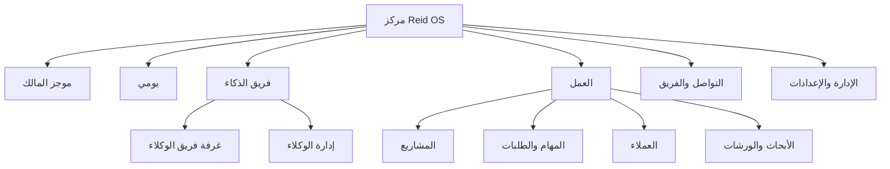

# خطة إعادة هيكلة Reid OS

التاريخ: 28 سبتمبر 2026  
الحالة: منفذة ومنشورة
النطاق: تجربة الموقع بعد تسجيل الدخول على سطح المكتب والهاتف، مع إبقاء الروابط والبيانات والصلاحيات الحالية متوافقة.

## النتيجة المطلوبة

تحويل الموقع من قائمة طويلة لصفحات منفصلة إلى نظام تشغيل شركة واضح يبدأ من مركز واحد، ويجعل العمل اليومي وفريق الوكلاء والموافقات في أماكن ثابتة وسهلة الوصول.

يجب أن يستطيع المالك بعد تسجيل الدخول أن:

1. يرى وضع الشركة وما يحتاج قراره فورًا.
2. يفتح فريق الوكلاء من أعلى القائمة وبنقرة واحدة.
3. يرسل مهمة لوكيل أو عدة وكلاء ويتابع التسليم والنتيجة.
4. ينتقل من التنبيه إلى المشروع أو العميل أو الموافقة المرتبطة به.
5. يستخدم الموقع كاملًا على الهاتف دون روابط مخفية أو تمرير داخلي مربك.

## التشخيص الحالي

- القائمة الجانبية تحتوي صفحات كثيرة موزعة على أربع مجموعات، و«فريق الوكلاء» يأتي بعد تسعة روابط تقريبًا.
- عنصر `nav` داخل القائمة لا يملك ارتفاعًا مرنًا وتمريرًا رأسيًا؛ لذلك يمكن أن تختفي مجموعة «الذكاء» أسفل الشاشة.
- صفحات `/owner` و`/today` و`/workspace` و`/operations` تتقاطع في الغرض، ولا توضح للمستخدم أين يبدأ وأين يدير الفريق أو العمل.
- `/assistant` هو غرفة الفريق، بينما اسم `/dashboard` هو «مركز الإدارة» رغم أنه مخصص لإدارة الوكلاء؛ هذا يسبب التباسًا.
- الترويسة تعرض اسم الصفحة فقط، ولا توفر بحثًا عامًا أو إنشاءً سريعًا أو وصولًا مباشرًا للموافقات.
- الصفحات مبنية في أزمنة مختلفة وتستخدم كثافات وعناوين وأزرارًا وحالات فارغة غير موحدة.

## هيكل المعلومات الجديد

### 1. المركز

- **موجز المالك** `/owner`: القرار، المخاطر، مؤشرات الشركة، وما يحتاج متابعة.
- **يومي** `/today`: مهام المستخدم وتنبيهاته ومواعيده.

### 2. فريق الذكاء

- **غرفة فريق الوكلاء** `/assistant`: الصفحة الأساسية والبارزة في القائمة.
- **إدارة الوكلاء** `/dashboard`: الحالة، المزود، الطابور، الصلاحيات وسجل التشغيل.
- شارة عدد تعرض المهام الجارية أو الموافقات المنتظرة.

### 3. العمل

- **المشاريع** `/projects`.
- **المهام والطلبات** `/operations` بدل الاسم العام «إدارة الأعمال».
- **العملاء والمبيعات** `/crm`.
- **الأبحاث** `/research`.
- **الورشات** `/workshops`.

### 4. التواصل والفريق

- **محادثات واتساب** `/inbox` للمالك.
- **الفريق** `/workspace`: الأشخاص، توزيع العمل، الملفات والسجل المرتبط بالموظف.

### 5. الإعدادات والإدارة

- **الحسابات والصلاحيات** `/admin`.
- **الاتصالات والتكاملات** `/connections`.
- **حسابي** `/profile`.

تبقى المسارات الحالية صالحة حتى لا تنكسر الروابط المحفوظة. التغيير يكون في الأسماء والترتيب وتجربة الاستخدام، ثم يمكن إضافة مسارات وصفية جديدة مع تحويلات دائمة في مرحلة لاحقة.

## شكل النظام الجديد

## مراحل التنفيذ

### المرحلة 0: إظهار فريق الوكلاء فورًا

- نقل مجموعة «فريق الذكاء» لتأتي بعد «المركز» مباشرة.
- جعل «غرفة فريق الوكلاء» عنصرًا بارزًا بلون الهوية وحالة الوكلاء.
- جعل منطقة روابط القائمة `flex: 1` مع `overflow-y: auto`، وتثبيت زر الخروج أسفلها.
- تمرير العنصر النشط إلى مجال الرؤية تلقائيًا عند فتح الصفحة.
- إضافة زر «افتح فريق الوكلاء» داخل موجز المالك وصفحة «يومي».
- إضافة خلفية إغلاق للقائمة على الهاتف، وإغلاقها بعد الانتقال أو الضغط خارجها.

معيار القبول: يظهر «فريق الوكلاء» دون تمرير على شاشة المالك المعتادة، ويظل قابلًا للوصول على ارتفاع 667px وعند تكبير المتصفح إلى 200%.

### المرحلة 1: إعادة بناء هيكل التنقل

- استخراج تعريف القائمة من `main.tsx` إلى ملف إعداد واحد يحتوي الاسم، المجموعة، الأيقونة، الأولوية والصلاحيات.
- جعل المسارات والقائمة وعنوان الصفحة ومسار التتبع تعتمد المصدر نفسه.
- إضافة وضع قائمة مصغرة على سطح المكتب مع حفظ اختيار المستخدم محليًا.
- إضافة «انتقال سريع» يدعم البحث باسم الصفحة والوصول بلوحة المفاتيح.
- عرض عدد الموافقات والرسائل والمهام المتأخرة بجوار الوجهة المناسبة.
- توحيد ترويسة داخلية تحتوي عنوان الصفحة، وصفًا مختصرًا، بحثًا، زر إنشاء سريع، اللغة، والمظهر.

معيار القبول: لا توجد وجهة مكررة أو مخفية، وكل صفحة مسموحة تظهر مرة واحدة فقط حسب دور المستخدم.

### المرحلة 2: مركز قيادة موحد

- إعادة بناء `/owner` كمركز البداية للمالك.
- الصف الأول: ما يحتاج قرارًا، أعمال متأخرة، وكلاء متعطلون، رسائل غير معالجة.
- الصف الثاني: المشاريع الجارية والعملاء والمتابعة والتوظيف.
- لوحة «الفريق يعمل الآن» تعرض تشغيلات الوكلاء مع فتح غرفة الفريق على الرسالة المرتبطة.
- نشاط حديث موحد يربط الحدث بالسجل الحقيقي بدل بطاقات ساكنة.
- إجراءات سريعة: مهمة، مشروع، عميل، رسالة للفريق، ومراجعة موافقة.

معيار القبول: يستطيع المالك الوصول إلى أي عنصر يحتاج قرارًا خلال نقرتين، وكل رقم يفتح البيانات التي كوّنته.

### المرحلة 3: توحيد صفحات العمل

- اعتماد قالب صفحة واحد: عنوان، وصف، إجراءات، مرشحات، محتوى، حالة فارغة، وخطأ قابل لإعادة المحاولة.
- المشاريع: قائمة وبطاقات متجاوبة مع حالة ومسؤول وخطوة تالية.
- المهام والطلبات: فصل الأنواع بمرشحات واضحة بدل تبويبات مزدحمة، وإضافة عرض «المسند إلي».
- CRM: خط مراحل واضح، متابعة قادمة، وفتح سجل العميل من أي تنبيه.
- الفريق: دليل موظفين وتوزيع عمل بدل خلطه مع لوحة التشغيل.
- الأبحاث والورشات: نفس نمط البحث، الفلاتر، الإنشاء والتفاصيل.
- إزالة البطاقات أو النصوص التجريبية، وعدم إنشاء أرقام افتراضية عند غياب البيانات.

معيار القبول: كل وحدة تعرض بيانات الإنتاج فقط، وتحافظ على صلاحيات RLS، وتعمل على عرض 360px دون تمرير أفقي للصفحة.

### المرحلة 4: تطوير غرفة فريق الوكلاء

- إبقاؤها في مساحة كبيرة تشبه غرفة عمل، مع قائمة وكلاء ثابتة وحالة كل وكيل.
- استبدال صف أزرار المنشن الطويل باقتراحات تظهر عند كتابة `@`، مع دعم العربية والإنجليزية.
- إظهار «ردًا على» ومسار تسليم المهمة بين الوكلاء.
- فصل رسائل المستخدم، ردود الوكلاء، أحداث النظام والموافقات بصريًا.
- إضافة لوحة جانبية للمهمة الحالية: المسؤول، الحالة، وقت البدء، التسليمات، والموافقة المطلوبة.
- إضافة بحث داخل المحادثة وفلاتر حسب الوكيل والحالة.
- إظهار زر إعادة المحاولة عند الفشل، وزر إلغاء للعمل المنتظر، دون تكرار تشغيل ناجح.
- إشعارات غير مزعجة عند اكتمال عمل طويل، مع شارة غير مقروءة في القائمة.
- إبقاء حد التسليمات ومنع الحلقات، وإبقاء العمليات الحساسة في مركز الموافقات.

معيار القبول: إرسال منشن واحد أو متعدد، حفظ المحادثة، Realtime، التسليم بين الوكلاء، الفشل، إعادة المحاولة والموافقة تعمل كتدفق واحد يمكن تتبعه.

### المرحلة 5: نظام التصميم والاستجابة

- توحيد عرض المحتوى، المسافات، أحجام العناوين، الأزرار، الحقول، الجداول، البطاقات والشارات.
- تحويل الأنماط المتكررة إلى مكونات React مشتركة بدل نسخ CSS في كل صفحة.
- اعتماد ثلاثة مستويات كثافة: مركز، قائمة تشغيلية، وصفحة تفاصيل.
- تحسين RTL في الأيقونات والجداول ومسار التتبع، مع مطابقة الإنجليزية LTR.
- دعم لوحة المفاتيح، مؤشرات التركيز، قارئ الشاشة، تقليل الحركة، والتباين.
- على الهاتف: قائمة منزلقة، شريط إجراءات سفلي عند الحاجة، جداول تتحول لبطاقات، ومناطق لمس لا تقل عن 44px.

معيار القبول: لا يوجد قص للنص أو تداخل أو تمرير أفقي على 360/390/768/1024/1440px، ويظل الاستخدام ممكنًا بلوحة المفاتيح فقط.

### المرحلة 6: الأداء والجودة والنشر

- تقسيم الحزمة حسب الصفحة باستخدام lazy loading لتقليل حجم JavaScript الأولي.
- تحميل البيانات المطلوبة للصفحة فقط، مع إلغاء الطلبات عند الانتقال ومنع الاستعلامات المكررة.
- حالات تحميل هيكلية، رسائل خطأ مفهومة، وزر إعادة المحاولة.
- اختبارات عقود للمسارات والقائمة والصلاحيات.
- اختبارات مكونات للتنقل والمنشن والتسليم والموافقات.
- اختبارات RLS لعزل غرف الوكلاء والحسابات.
- اختبارات متصفح للمالك والموظف على سطح المكتب والهاتف بالعربية والإنجليزية.
- قياس الوصول والأداء، وفحص الروابط المكسورة والأخطاء في وحدة التحكم.
- نشر تدريجي مع صورة رجوع قبل كل مرحلة، وفحص صحة محلي وعام بعد التفعيل.

معيار القبول: جميع الاختبارات والبناء وفحوص الإنتاج تنجح، ولا ترتفع أخطاء الواجهة أو API بعد النشر.

## ترتيب التنفيذ المقترح

1. المرحلة 0 والمرحلة 1 معًا: إصلاح المشكلة الحالية وتثبيت هيكل التنقل.
2. المرحلة 2: مركز المالك لأنه نقطة البداية التي تربط باقي النظام.
3. المرحلة 4: غرفة الوكلاء لأنها الميزة الأساسية المطلوبة.
4. المرحلة 3: توحيد وحدات العمل واحدة تلو الأخرى.
5. المرحلة 5: إكمال المكونات المشتركة والاستجابة أثناء نقل الصفحات.
6. المرحلة 6: تحسين الحزمة، التحقق الشامل، ثم النشر النهائي.

## قواعد حماية البيانات والصلاحيات

- لا تُنقل صلاحية إلى الواجهة؛ قاعدة البيانات والدوال تظل صاحبة القرار.
- لا تُعرض أرقام أو سجلات من حساب آخر أثناء تجميع لوحة المركز.
- رسائل الوكلاء لا تُكتب من المتصفح باسم وكيل.
- كل تغيير حساس يحمل معاينة وموافقة وسجل تدقيق.
- لا تُحذف البيانات الحالية أثناء إعادة الهيكلة؛ أي تنظيف بيانات تجريبية يتم باستعلام محدد وقابل للمراجعة.

## تعريف الاكتمال

تُعد إعادة الهيكلة مكتملة عندما:

- يظهر فريق الوكلاء بوضوح لكل دور مسموح له.
- يتطابق التنقل والعناوين والصلاحيات على كل الصفحات.
- تعمل تدفقات المالك والعمل والوكلاء على الإنتاج ببيانات حقيقية.
- تمر اختبارات الواجهة وRLS والمتصفح والبناء.
- تعمل الروابط القديمة أو تتحول إلى البديل الصحيح.
- توجد صورة رجوع موثقة، وسجل تحقق في `AGENTS.md`، ولا توجد عناصر تجريبية في واجهة الإنتاج.
